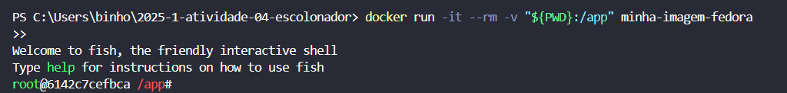

# Relatório de Execução e Modificação do Programa Threads CPU e I/O

---

## 1. Criação da Imagem Docker

A etapa inicial envolveu a construção de uma imagem Docker customizada, chamada "minha-imagem-fedora". Essa imagem foi utilizada como a base do ambiente de execução da aplicação, assegurando um ambiente isolado e consistente.


---

## 2. Execução do Contêiner em Modo Interativo

Na sequência, um contêiner foi iniciado em modo interativo com a imagem previamente criada. Para facilitar o uso, o terminal fish foi adotado, oferecendo uma interface de linha de comando mais intuitiva e eficiente.



---

## 3. Compilação e Execução do Código Original

No terceiro estágio, o código inicial do programa threads_cpu_io foi compilado e executado dentro do contêiner. Essa versão original emprega threads tanto CPU-bound quanto I/O-bound, sendo que o processamento intensivo da CPU se baseia na série de Taylor para e^x
 .

---

## 4. Modificações no Código

A seguir, foram aplicadas as seguintes alterações no programa:

- **Substituição do cálculo CPU-bound:** O cálculo baseado na série de Taylor para \( e^x \) foi trocado por uma estimativa do valor de \(\pi\), utilizando a série de Leibniz:

\[
\pi \approx 4 \sum_{k=0}^{n} \frac{(-1)^k}{2k + 1}
\]

- **Adição de threads:** Uma terceira thread foi adicionada para cada tipo, totalizando três threads CPU-bound e três threads I/O-bound, com o objetivo de aumentar a carga de trabalho e aprimorar a simulação.

- **Aumento da carga computacional:** A quantidade de iterações no cálculo CPU-bound foi ampliada, a fim de intensificar o esforço computacional e destacar com mais clareza o desempenho das threads.
---

## 5. Compilação e Execução do Código Modificado

Após as modificações, o código foi recompilado e executado novamente dentro do contêiner, com o objetivo de validar as alterações e analisar o comportamento diante da nova carga de trabalho e do novo tipo de cálculo.


---

## 6. Instalação da Ferramenta de Perfomance `perf`

Para uma análise mais aprofundada de desempenho, o pacote `perf` foi instalado por meio do gerenciador de pacotes `dnf`, utilizando o seguinte comando:


```bash
dnf -y install perf
```

---

Essa ferramenta permite a coleta de estatísticas detalhadas sobre o uso da CPU, cache, ciclos de clock, entre outros.

## 7. Análise de Performance com `perf`

Por último, empregou-se a ferramenta `perf stat` para monitorar o desempenho do programa, por meio da execução do seguinte comando:


```bash
perf stat ./threads_cpu_io
```

---

# Considerações Finais

A realização deste trabalho proporcionou uma vivência prática enriquecedora na implementação e análise de threads com perfis distintos de carga — CPU-bound e I/O-bound. O uso do Docker como ambiente isolado e reprodutível foi essencial para garantir estabilidade nas execuções e simplificar o gerenciamento das dependências envolvidas.

As alterações aplicadas ao código, como a troca do cálculo de \( e^x \) por uma estimativa de \(\pi\) via a série de Leibniz, somadas à adição de novas threads, elevaram significativamente a complexidade computacional. Isso tornou possível observar de forma mais precisa o comportamento das threads sob condições de maior exigência de processamento.

Outro ponto de destaque foi a instalação e o uso da ferramenta `perf`, que permitiu a coleta de métricas detalhadas, como ciclos de CPU, perdas de cache e número de instruções executadas. Essas informações forneceram uma visão abrangente sobre o uso de recursos, ajudando a identificar possíveis gargalos e oportunidades de otimização.

Em síntese, o experimento reforça a relevância de integrar práticas de programação concorrente com ferramentas de monitoramento de desempenho em ambientes controlados, promovendo uma compreensão mais profunda e a capacidade de construir soluções mais robustas e escaláveis.
